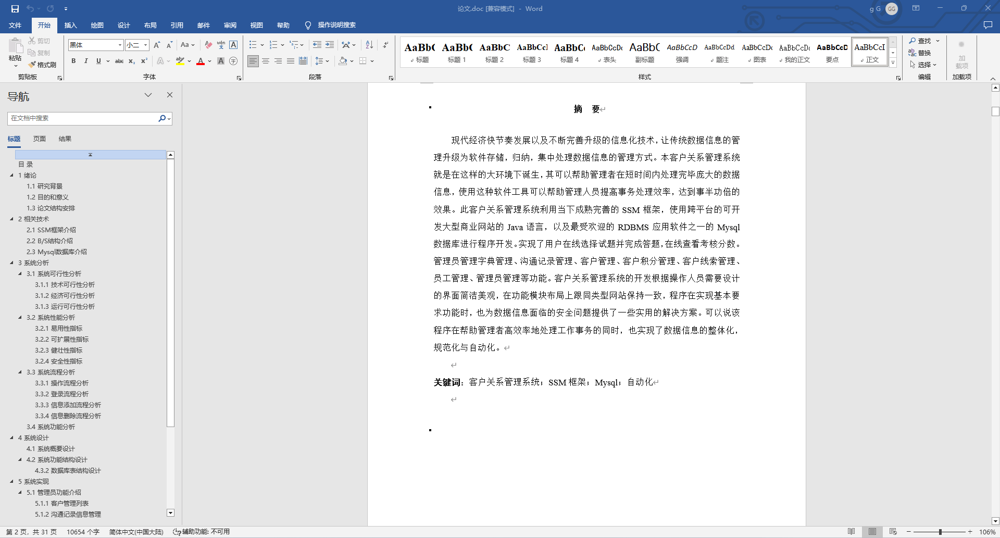
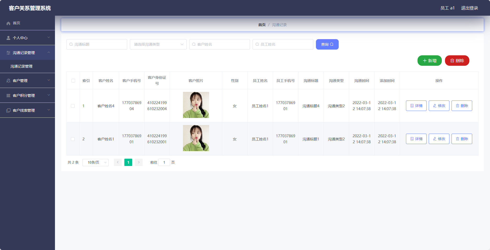
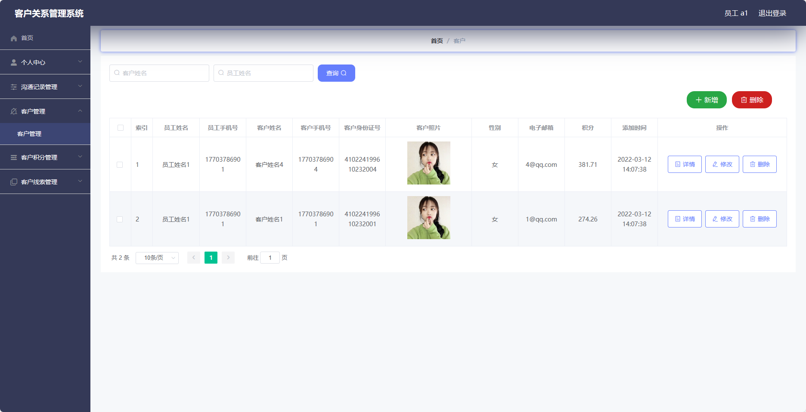
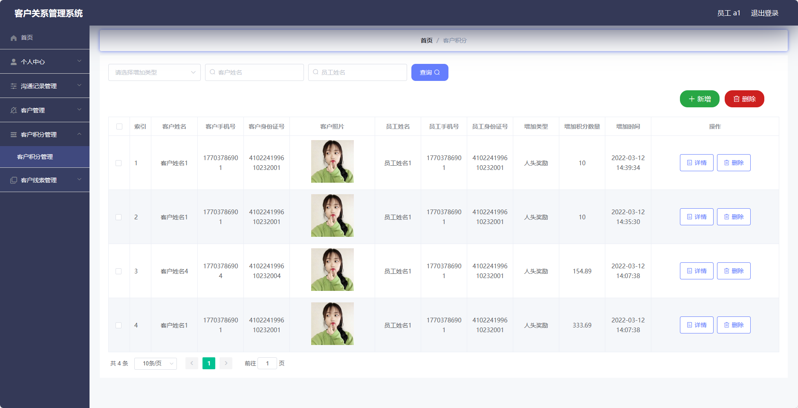
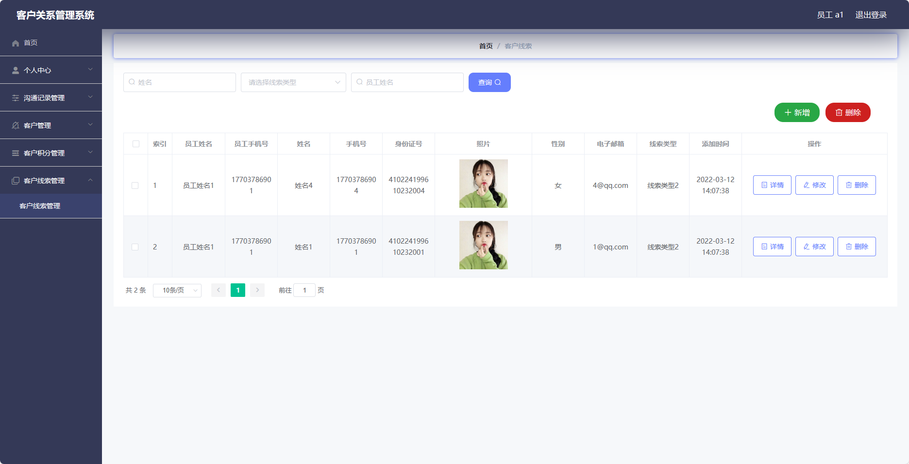
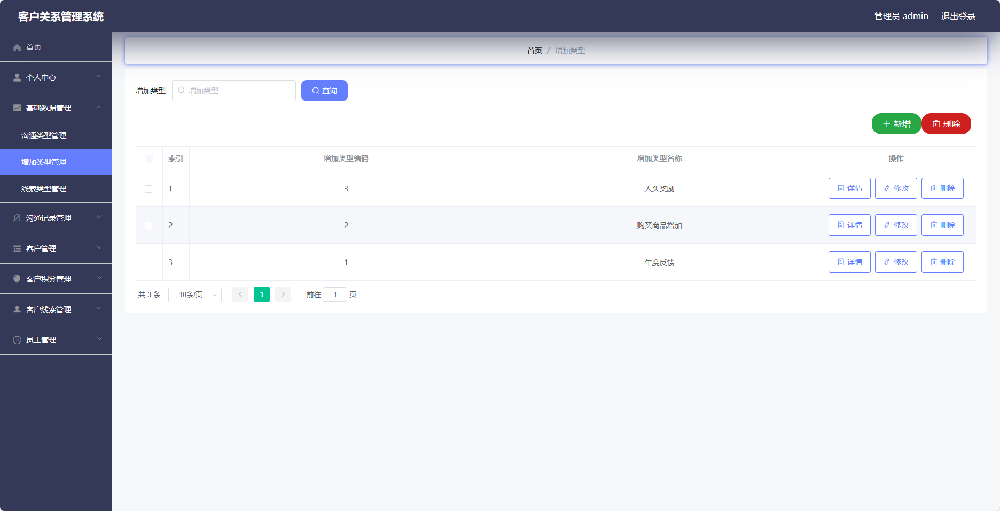
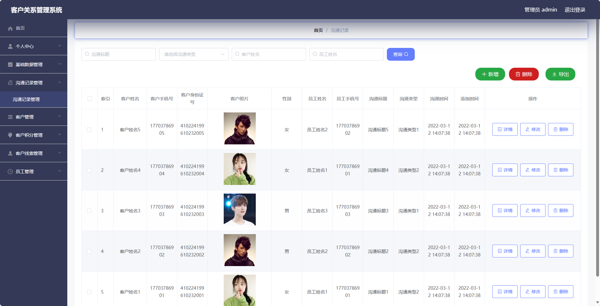
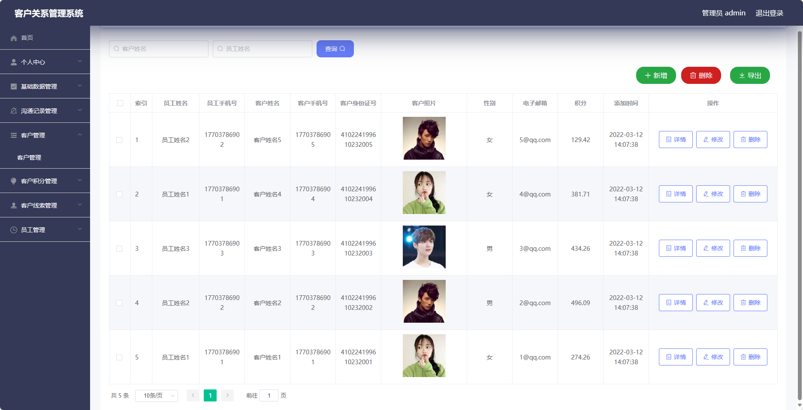
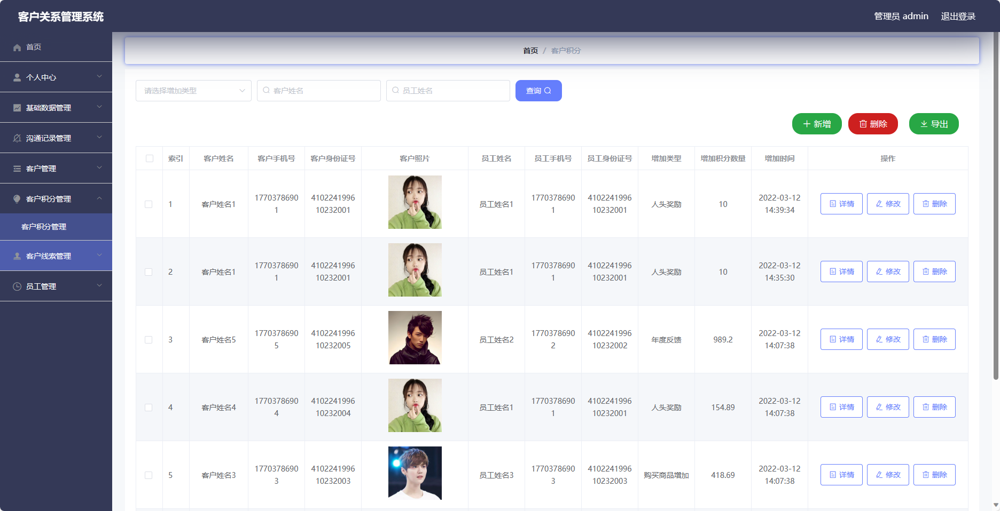
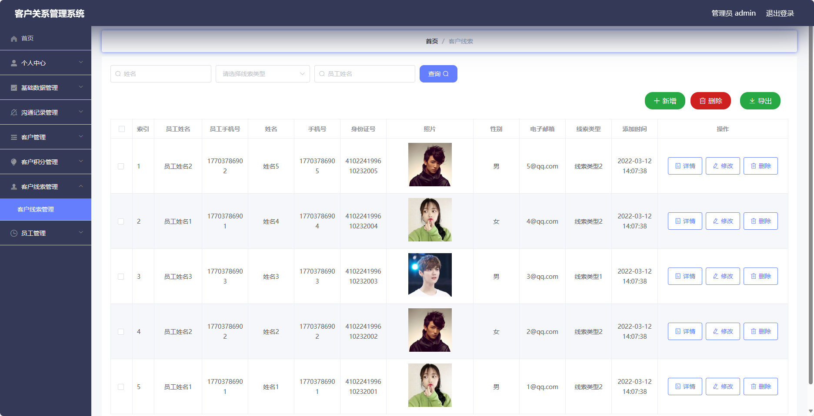

## 基于SpringBoot的客户关系管理系统(crm)(程序+报告)

###  获取sql数据库文件: 从戎源码网 (https://armycodes.com/) QQ: 386869957 QQ群: 377586148
###  所有系统地址: (https://github.com/YuLin-Coder/AllProjectCatalog) 
###  所有项目以及源代码本人均调试运行无问题 可支持远程安装部署调试、定制修改、代码讲解

## 项目介绍
基于SpringBoot的客户关系管理系统(crm)，系统包含两种角色：管理员、用户，主要功能如下。

### 【管理员】:
- 个人中心：管理个人信息。
- 基础数据管理：管理系统中的基础数据，包括客户分类、产品信息等。
- 沟通记录管理：管理与客户的沟通记录，包括添加、编辑、删除沟通记录等操作。
- 客户管理：管理系统中的客户信息，包括添加、编辑、删除客户等操作。
- 客户积分管理：管理客户的积分信息，包括积分兑换、积分调整等操作。
- 客户线索管理：管理客户线索信息，包括添加、编辑、删除线索等操作。
- 员工管理：管理系统中的员工信息，包括添加、编辑、删除员工等操作。

### 【用户】:
- 个人中心：管理个人信息。
- 沟通记录管理：管理个人与客户的沟通记录，包括添加、编辑、删除沟通记录等操作。
- 客户管理：浏览并管理个人负责的客户信息，包括添加、编辑、删除客户等操作。
- 客户积分管理：管理个人负责客户的积分信息，包括积分兑换、积分调整等操作。
- 客户线索管理：管理个人负责的客户线索信息，包括添加、编辑、删除线索等操作。

## 项目技术
- 编程语言：Java
- 数据库：MySQL
- 项目管理工具：Maven
- 前端技术：HTML、CSS、JavaScript、Jquery、Vue
- 后端技术：Spring、SpringMVC、MyBatis

## 运行环境
- JDK版本：JDK1.8及以上
- 开发工具：IDEA、Ecplise、Myecplise都可以
- 数据库: MySQL5.7及以上
- Maven：maven3.0及以上
- Node：14.14.0及以上

## 运行截图

